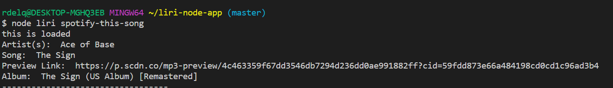
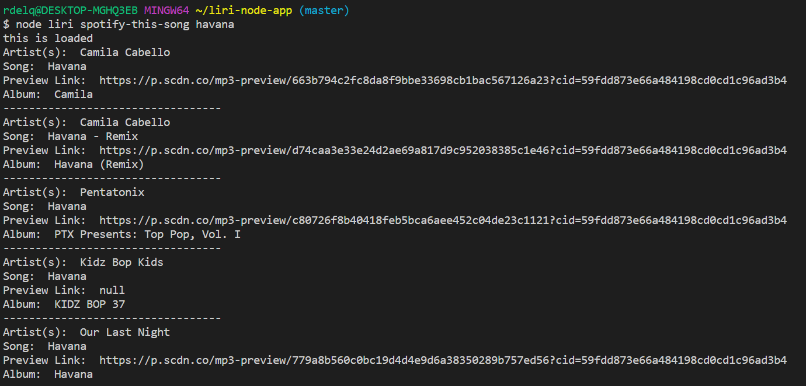
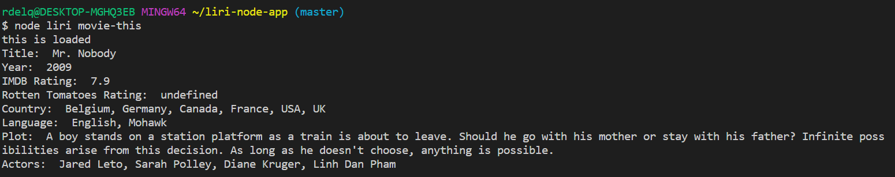
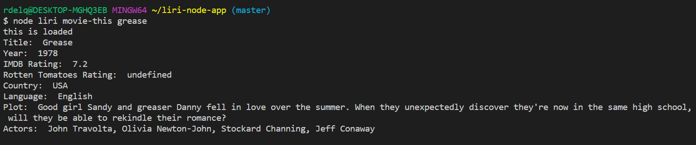
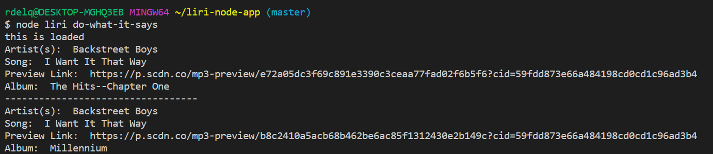

# LIRI (Language Interpretation and Recognition Interface)
In this assignment, I created a node.js app called **LIRI**, it is similar to iphones SIRI, but it is ran on the command line.  This is a command line node app that takes in parameters and gives back data.  In this app, **LIRI** has been given 4 commands.

* 'concert-this'
* 'spotify-this-song'
* 'movie-this'
* 'do-what-it-says'

The following screenshots will show how the 4 commands work.

This is what it looks like when **LIRI** is asked to 'concert-this'

The following 2 images are of **LIRI**'s command 'spotify-this-song'.  The first is when no song title is given, making 'The Sign' the default song, and the second is when a song title is given.

The next 2 images are of the command 'movie-this'.  The first image is when a movie title isn't given, and the default is Mr. Nobody, and the second image is when a movie title is given.  

The last image is the 'do-what-it-says' command.  This is where **LIRI** takes the text of a random file and uses it to call one of **LIRI**'s commands.

